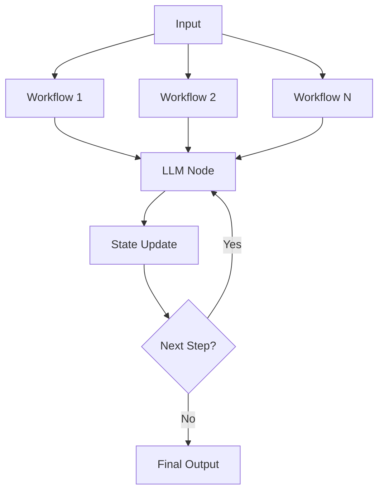
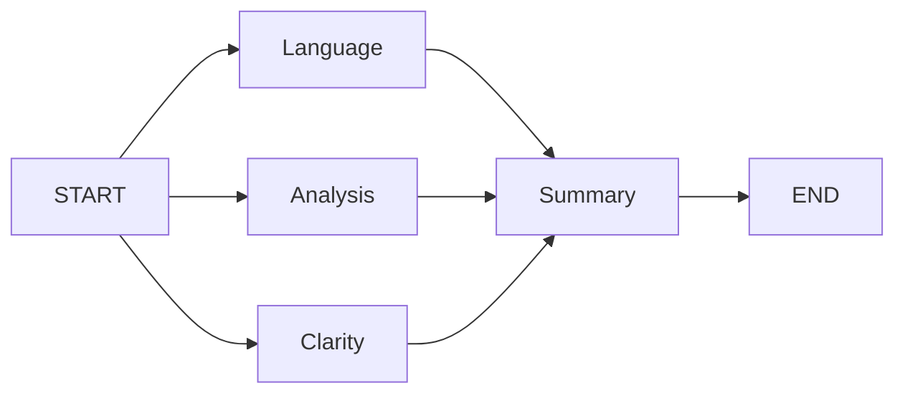

<div align="center">

# 🕸️ LangGraph Workflows

A collection of practical **LangGraph workflows** built while learning **Agentic AI**.

Exploring graph-based orchestration, state management, structured outputs, conditional routing, and multi-step LLM pipelines.


</div>

---

## Overview

This repository contains my **LangGraph practice workflows** and experiments while learning Agentic AI.

The goal is to understand how autonomous AI systems are built using graph-based execution, state management, multiple LLM nodes, structured outputs, and workflow orchestration.

As I continue learning, more workflows and examples will be added.

---

## Repository Structure

```
LangGraph/
│
├── workflows/
│   ├── essay_evaluator.ipynb
│   ├── chatbot.ipynb
│   ├── routing.ipynb
│   └── ...
│
├── assets/
│
└── README.md
```

---

## Learning Focus

- LangGraph Fundamentals
- StateGraph
- Nodes & Edges
- State Management
- Conditional Routing
- Parallel Execution
- Structured Output
- Multi-step LLM Workflows
- Agentic AI Concepts
- Prompt Engineering
- LangChain Integration
- Groq Integration
- Gemini Integration

---

## Workflow Architecture



---

## Example LangGraph Flow



---

## Current Workflows

- Essay Evaluation Workflow
- Structured Output Examples
- Parallel Node Execution
- State Management
- Multi-Step Evaluation Pipeline

> More workflows will be added as I continue exploring LangGraph.

---

## Tech Stack

- Python
- LangGraph
- LangChain
- Groq API
- Google Gemini API
- Pydantic
- Jupyter Notebook

---

## Getting Started

Clone the repository

```bash
git clone https://github.com/UBX-CODE/LangGraph.git
cd LangGraph
```

Create a virtual environment

```bash
python -m venv .venv
```

Activate it

### Windows

```bash
.venv\Scripts\activate
```

### Linux / macOS

```bash
source .venv/bin/activate
```

Install dependencies

```bash
pip install -r requirements.txt
```

Create a `.env` file

```env
GROQ_API_KEY=your_api_key
GOOGLE_API_KEY=your_api_key
OPENAI_API_KEY=your_api_key
```

Run any notebook from the `workflows` directory.

---

## Future Additions

- Multi-Agent Workflows
- RAG Pipelines
- Human-in-the-Loop
- Memory
- Tool Calling
- Supervisor Agents
- Reflection Agents
- Research Agents
- Autonomous Workflows

---

## Contributing

Suggestions and improvements are welcome.

Feel free to fork the repository, experiment with new workflows, and open a pull request.

---

<div align="center">

Built while learning **LangGraph** and **Agentic AI** 🚀

</div>